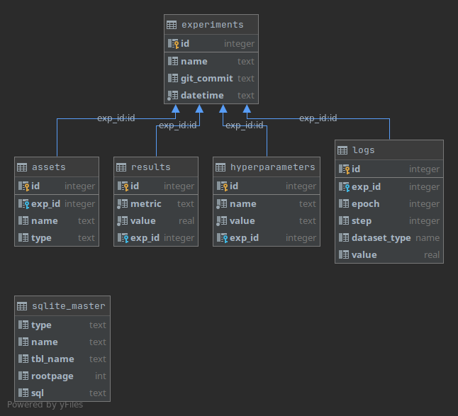

Recording experiments with SQLite
=================================

Store all your data in one place and leverage the power of SQL queries by using SQLite to log your experiment data. In labscribe, we include a class `SQLDatabase` to handle all the querying and setup of the database for you.

Getting Started
^^^^^^^^^^^^^^^

To begin can create a new `SQLDatabase` object::

  from labscribe import SQLDatabase

  exp = SQLDatabase(log_path="path/to/database.db",
                    name="name-of-experiment")

This will check for the existence of the database specified in `log_path`. If the database does not yet exist, a new one complete with a suite of tables will be created allowing you to start logging straight away.

Database Schema
^^^^^^^^^^^^^^^

The structure of the data is:

When a new experiment is created, a new row is added to the `experiments` table. This table's primary key (id) is used to reference the data from all other tables. The ID can be found using the SQL query to select by experiment name::

  SELECT id FROM experiments WHERE name="name-of-experiment";

Or more complex queries can be created using joins.

Logging Metrics
^^^^^^^^^^^^^^^

Like the other modules from labscribe, SQLDatabase has a number of logging functions that include `log_asset`, `log_hparams`, and `log_metric`. For example, if we wanted to save the results of the experiment we might use::

  exp.log_metric("accuracy", 0.95)

This data can be queried on the database using experiment id::

  SELECT * FROM results WHERE exp_id='your-id';

Logging Assets
^^^^^^^^^^^^^^

Assets, contrary to other logging functions, are not stored in the database directly. Rather, the filepath to the asset is stored in the database, while the file itself is stored on disk. This is of course a limitation of the storage capabilities of SQLite. However, you still call the function in the same way::

  exp.log_asset(obj, "filepath/to/save/to")

You may optionally set a file type to help with querying later on::

  exp.log_asset(obj, "filepath", file_type="image")

And then the SQL query::

  SELECT * FROM results WHERE type="image";
